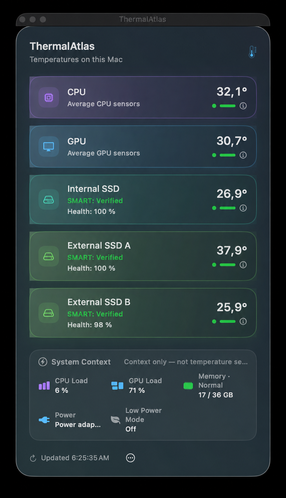
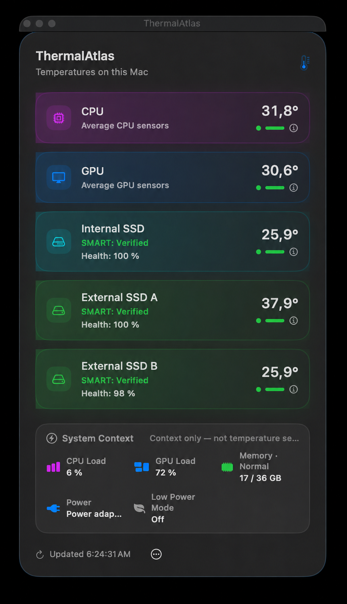
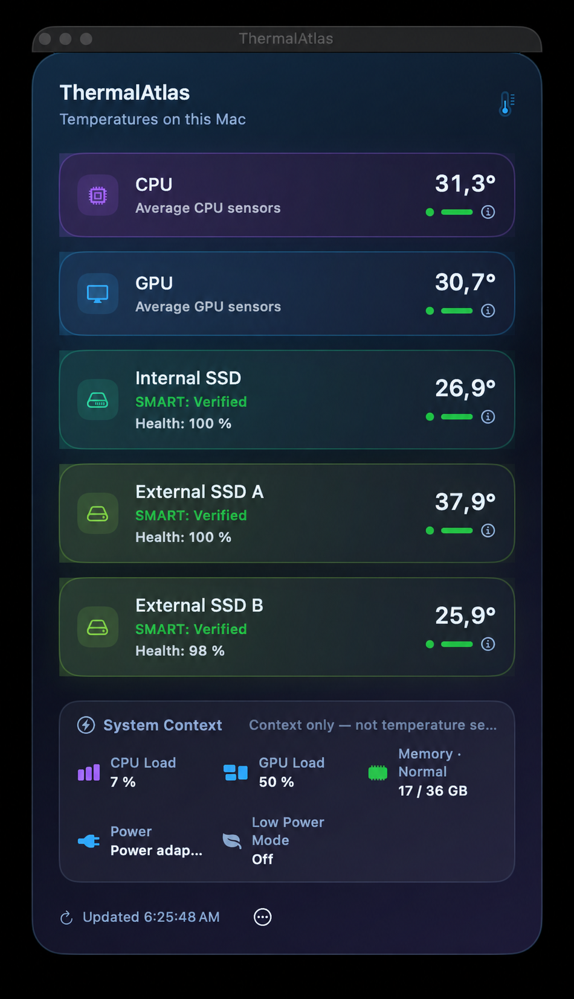
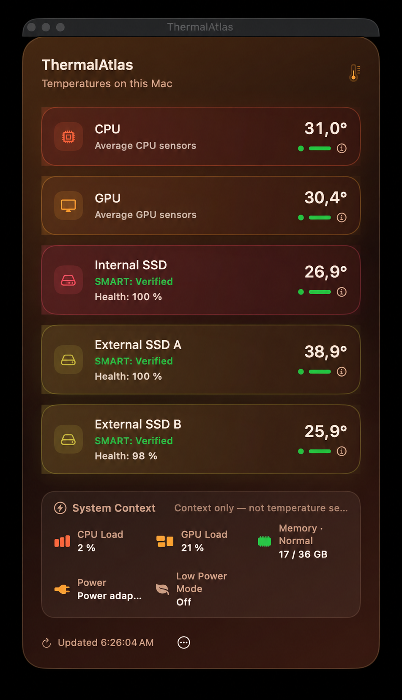

# ThermalAtlas – Benutzerhandbuch

  

  <strong>Schlanke, datenschutzfreundliche Temperaturanzeige für Apple Silicon</strong> 
  CPU · GPU · interne SSD · externe SSD

  <a href="MANUAL.md">English manual</a> · <a href="README.de.md">Zurück zur deutschen Startseite</a>

---

## 1. Was ist ThermalAtlas?

ThermalAtlas ist eine kompakte macOS-Menüleisten-App für Apple-Silicon-Macs. Sie zeigt echte Temperaturwerte für CPU, GPU, interne SSD und – sofern von macOS bzw. dem Laufwerkscontroller bereitgestellt – eine erkannte externe SSD.

Die App ist bewusst auf die Anzeige konzentriert. Sie verändert **keine Lüftersteuerung, keine Leistungsparameter, keine Energieeinstellungen und keine Systemeinstellungen**. Temperaturwerte werden nicht geschätzt: Ist kein echter Sensor- oder SMART-Wert verfügbar, zeigt ThermalAtlas **Nicht verfügbar**.

### Die wichtigsten Eigenschaften

| Bereich | Verhalten |
| --- | --- |
| CPU | Rein lesender Zugriff auf Apple-Silicon-SMC-Sensoren |
| GPU | Rein lesender Zugriff auf Apple-Silicon-SMC-Sensoren |
| Interne SSD | SMART-Temperatur, wenn macOS sie bereitstellt |
| Externe SSD | SMART-Temperatur, wenn Laufwerk und Gehäuse sie weiterreichen |
| Aktualisierung | Regulär alle 2 Sekunden |
| Speicherung | Nur das gewählte Theme wird lokal gespeichert |
| Netzwerk | Keine Netzwerkfunktion für die Temperaturanzeige |
| Telemetrie | Keine Telemetrie und keine Analyse-Dienste |

---

## 2. Die App-Oberfläche

Der folgende Screenshot stammt direkt von der ThermalAtlas-Startseite und zeigt das **Liquid-Glass-Theme** der App.

  

### Was du im Fenster siehst

**Temperaturkarten**  
Jede Karte steht für eine Messgruppe: CPU, GPU, interne SSD und externe SSD. Rechts wird die aktuelle Temperatur angezeigt. Unter dem Namen steht die Herkunft bzw. der Status des Messwerts.

**Farbliche Statusanzeige**

| Farbe | Temperaturbereich | Bedeutung |
| --- | ---: | --- |
| 🟢 Grün | unter 55 °C | kühler bzw. normaler Bereich |
| 🟠 Orange | 55 bis unter 75 °C | erhöhte Temperatur |
| 🔴 Rot | ab 75 °C | hoher Temperaturbereich |
| ⚪ Grau | kein Messwert | echter Wert nicht verfügbar |

Die Farben dienen als schnelle Orientierung. ThermalAtlas verändert aufgrund dieser Anzeige nichts am Mac.

**Zeitpunkt „Aktualisiert“**  
Unten im Fenster steht die Uhrzeit des zuletzt übernommenen Sensor-Snapshots. Die reguläre Abfrage erfolgt alle zwei Sekunden.

---

## 3. Menüleisten-Anzeige

Nach dem Start erscheint ThermalAtlas als Thermometer in der macOS-Menüleiste. Neben dem Symbol wird die **höchste aktuell verfügbare Temperatur** als ganze Zahl dargestellt.

Das ist kein zusätzlicher Sensor. ThermalAtlas nimmt dafür einfach den höchsten verfügbaren Temperaturwert aus den aktuell angezeigten Messgruppen. Ein Klick auf das Menüleisten-Symbol öffnet das ThermalAtlas-Fenster.

---

## 4. Buttons und Bedienelemente

### Theme

Der Button **Theme** öffnet die Auswahl der vier Darstellungen:

- **Klassisch** – zurückhaltende, systemnahe Optik
- **Liquid Glass** – transparente Glass-Flächen mit statischem Glow
- **Aurora** – dunkle Blau-/Violett-Töne
- **Ember** – warme Rot-/Orange-Töne

Die Auswahl verändert nur die Darstellung, nicht die Messlogik. Das gewählte Theme wird lokal in `UserDefaults` gespeichert.

> Die frühere dauerhaft pulsierende Glow-Animation des Liquid-Glass-Themes wurde entfernt. Der Glass-Look bleibt statisch erhalten.

### Aktivitätsanzeige-Button

Der Button mit dem **Aktivitäts-/Kurven-Symbol** öffnet die macOS-App **Aktivitätsanzeige**.

Das ist praktisch, wenn du zusätzlich prüfen möchtest, welche Prozesse gerade CPU, Arbeitsspeicher, Energie oder andere Systemressourcen verwenden. ThermalAtlas ersetzt diese Systemanzeige nicht und liest diese Werte über den Button auch nicht selbst aus.

### Beenden-Button

Der Button mit dem **Ein-/Aus-Symbol** beendet ThermalAtlas vollständig. Danach stoppt auch die regelmäßige Sensorabfrage. Zum erneuten Verwenden muss die App wieder gestartet werden.

---

## 5. CPU- und GPU-Temperaturen

ThermalAtlas verwendet für CPU und GPU einen rein lesenden Apple-Silicon-SMC-Zugriff über IOKit.

### CPU

Für die CPU wird aus den lesbaren CPU-Sensoren ein arithmetischer Mittelwert gebildet. Die App zeigt damit einen kompakten Durchschnittswert statt einer langen Liste einzelner Kerne.

### GPU

Auch für die GPU wird aus den verfügbaren GPU-Zonen ein Mittelwert gebildet.

Falls der private SMC-Transport bei einer einzelnen Aktualisierung kurzzeitig keinen GPU-Wert liefert, kann ThermalAtlas den **letzten zuvor verifizierten echten GPU-Wert** vorübergehend weiter anzeigen. Dieser Wert ist in der Oberfläche ausdrücklich als letzter echter Wert gekennzeichnet und läuft nach kurzer Zeit aus; er ist keine Schätzung.

---

## 6. SSD-Temperaturen und „Nicht verfügbar“

ThermalAtlas verwendet für Laufwerksinformationen die von macOS bereitgestellten `diskutil`-Daten.

Eine SSD-Temperatur wird nur angezeigt, wenn ein echter SMART-Wert vorhanden ist. Besonders bei externen SSDs hängt das davon ab, ob das Laufwerk, der USB-/Thunderbolt-Controller und das Gehäuse die Temperaturinformation bis macOS weiterreichen.

### Wenn „Nicht verfügbar“ erscheint

Das bedeutet nicht automatisch, dass mit dem Laufwerk etwas nicht stimmt. Mögliche Gründe sind:

- macOS stellt für dieses Gerät keinen Temperaturwert bereit.
- Das externe Gehäuse reicht SMART-Daten nicht weiter.
- Ein Sensor ist auf diesem Mac-Modell nicht über den verwendeten read-only-Zugriff verfügbar.
- Es wurde kein passendes externes Solid-State-Laufwerk erkannt.

ThermalAtlas zeigt in diesen Fällen bewusst **keinen erfundenen oder geschätzten Wert**.

---

## 7. Installation

### Download

Lade ein verfügbares macOS-Paket ausschließlich über die offiziellen [ThermalAtlas Releases](https://github.com/Schrotty74/ThermalAtlas/releases) herunter.

1. DMG öffnen.
2. `ThermalAtlas.app` in den Programme-Ordner ziehen.
3. ThermalAtlas starten.

### Gatekeeper beim ersten Start

Öffentliche Vorab-Builds sind derzeit ad-hoc signiert und nicht mit einer Apple-Developer-Program-Identität notarisiert. Deshalb kann macOS beim ersten Start eine Warnung anzeigen.

1. Im Finder per Rechtsklick bzw. Control-Klick auf `ThermalAtlas.app` klicken.
2. **Öffnen** wählen.
3. **Öffnen** im macOS-Dialog bestätigen.
4. Falls macOS die App weiterhin blockiert: **Systemeinstellungen → Datenschutz & Sicherheit → Dennoch öffnen**.

Bestätige eine solche Ausnahme nur für eine App, die du aus dem offiziellen ThermalAtlas-Repository geladen hast.

---

## 8. Themes im Überblick

| Klassisch | Liquid Glass |
| --- | --- |
|  |  |
| **Aurora** | **Ember** |
|  |  |

Alle vier Themes zeigen dieselben Messdaten. Die Unterschiede sind rein visuell.

---

## 9. Datenschutz

ThermalAtlas ist datenschutzfreundlich und lokal ausgerichtet:

- keine Benutzerkonten
- keine Telemetrie
- keine Analyse-Dienste
- keine Cloud-Synchronisation
- keine Werbe-SDKs
- keine dauerhafte Speicherung der Temperaturmesswerte
- keine Netzwerkfunktion für die Temperaturanzeige
- keine Drittanbieter-Abhängigkeiten

Lokal gespeichert wird nur das ausgewählte Theme. Weitere Details stehen im [Datenschutzbericht](PRIVACY.de.md) und in der [Sicherheitsprüfung](SECURITY.md).

---

## 10. Ressourcenverbrauch

ThermalAtlas ist architektonisch kompakt aufgebaut: eine Menüleisten-App, ein Sensor-Snapshot im Zwei-Sekunden-Takt und read-only Sensorzugriffe. Die frühere dauerhafte Liquid-Glass-Glow-Animation wurde entfernt.

Eine öffentliche Aussage wie **„extrem niedrige CPU-/GPU-Nutzung“** wird in diesem Handbuch bewusst nicht behauptet, solange dafür kein reproduzierbarer Laufzeittest mit gemessenen Werten vorliegt.

---

## 11. Voraussetzungen und Projektstatus

- macOS 14 oder neuer
- Apple Silicon
- Für eigene Builds: Xcode Command Line Tools mit Swift und `actool`

ThermalAtlas befindet sich in aktiver Entwicklung. Öffentliche Vorab-Builds werden über [GitHub Releases](https://github.com/Schrotty74/ThermalAtlas/releases) veröffentlicht.

---

## 12. Weitere Informationen

- [ThermalAtlas Startseite](README.de.md)
- [Releases und Downloads](https://github.com/Schrotty74/ThermalAtlas/releases)
- [Datenschutzbericht](PRIVACY.de.md)
- [Sicherheitsprüfung](SECURITY.md)
- [Quellcode](https://github.com/Schrotty74/ThermalAtlas)
- [English User Manual](MANUAL.md)
