# ThermalAtlas - User Manual

  

  <strong>Lightweight, privacy-friendly temperature monitoring for Apple silicon</strong> 
  CPU - GPU - internal SSD - external SSDs

  <a href="MANUAL.de.md">Deutsches Handbuch</a> - <a href="README.md">Back to the English home page</a>

---

## 1. What is ThermalAtlas?

ThermalAtlas is a compact macOS menu bar app for Apple-silicon Macs. It shows genuine temperature readings for CPU, GPU, the internal SSD and every detected physical external SSD when macOS or the drive controller exposes them.

The app is deliberately focused on monitoring. It changes **no fan control, performance parameter, power setting or system setting**. Values are never estimated: when no real sensor or SMART value is available, ThermalAtlas displays **Not available**.

### Key characteristics

| Area | Behavior |
| --- | --- |
| CPU | Read-only Apple-silicon SMC sensors; readable sensors are averaged |
| GPU | Read-only Apple-silicon SMC sensors; readable zones are averaged |
| Internal SSD | SMART temperature, status and health only when macOS exposes real data |
| External SSDs | Each physical external SSD is shown separately when macOS identifies it |
| Refresh | User-selectable every 1, 2, 3 or 4 seconds; default: 2 seconds |
| Storage | Local settings, warning thresholds and a maximum of 24 hours of minute-averaged temperature history are stored locally |
| Network | No network feature is required for temperature monitoring |
| Telemetry | No telemetry or analytics services |

---

## 2. The app interface

The screenshots in this manual show the current ThermalAtlas interface. The displayed SSD names, temperatures and health figures are examples from the captured Mac; the number and names of external SSD cards vary by connected hardware.

  

### What you see in the window

**Temperature cards**  
CPU and GPU cards show the average of the readable matching sensors. Each SSD card shows the real drive or mounted-volume name. The current temperature is shown on the right.

**SSD status and health**
When macOS supplies it, an SSD card shows `SMART: Verified` and a separate remaining-health percentage. The percentage is derived only from the drive's NVMe `PERCENTAGE_USED` data. If SMART data or that field is absent, ThermalAtlas does not invent a status or percentage.

**Last real GPU value**
If a short GPU SMC read fails, ThermalAtlas can retain the last previously verified real GPU reading briefly. The orange label in the Aurora screenshot makes this explicit; it is not an estimate and expires after a short period.

  

**Color status indicator**

| Color | Temperature range | Meaning |
| --- | ---: | --- |
| Green | below 55 C | cool / normal range |
| Orange | 55 to below 75 C | elevated temperature |
| Red | 75 C and above | high temperature range |
| Gray | no reading | no real temperature value available |

The colors are a quick visual guide only. ThermalAtlas does not change anything on the Mac because of these indicators.

**Updated time**  
The bottom of the window shows the time of the latest accepted sensor snapshot.

**System context**
Below the temperature cards, ThermalAtlas shows CPU and GPU load, used memory in relation to installed RAM, power source or battery, and Low Power Mode. It is explicitly marked as context rather than a temperature sensor. These values update independently every 0.5 seconds; CPU load is calculated from two successive system snapshots, so it appears after the second context update. These read-only values never change macOS energy settings and are not stored.

  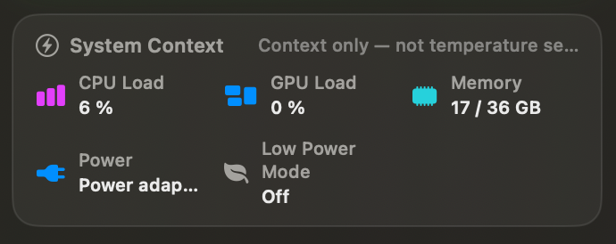

### System Information

Select the thermometer in the upper-right corner of the ThermalAtlas window to open **System Information**. This separate local window shows the Mac model, Apple chip, CPU and GPU core counts, installed memory, internal storage, and macOS version. The core summary uses P for performance cores and E for efficiency cores.

  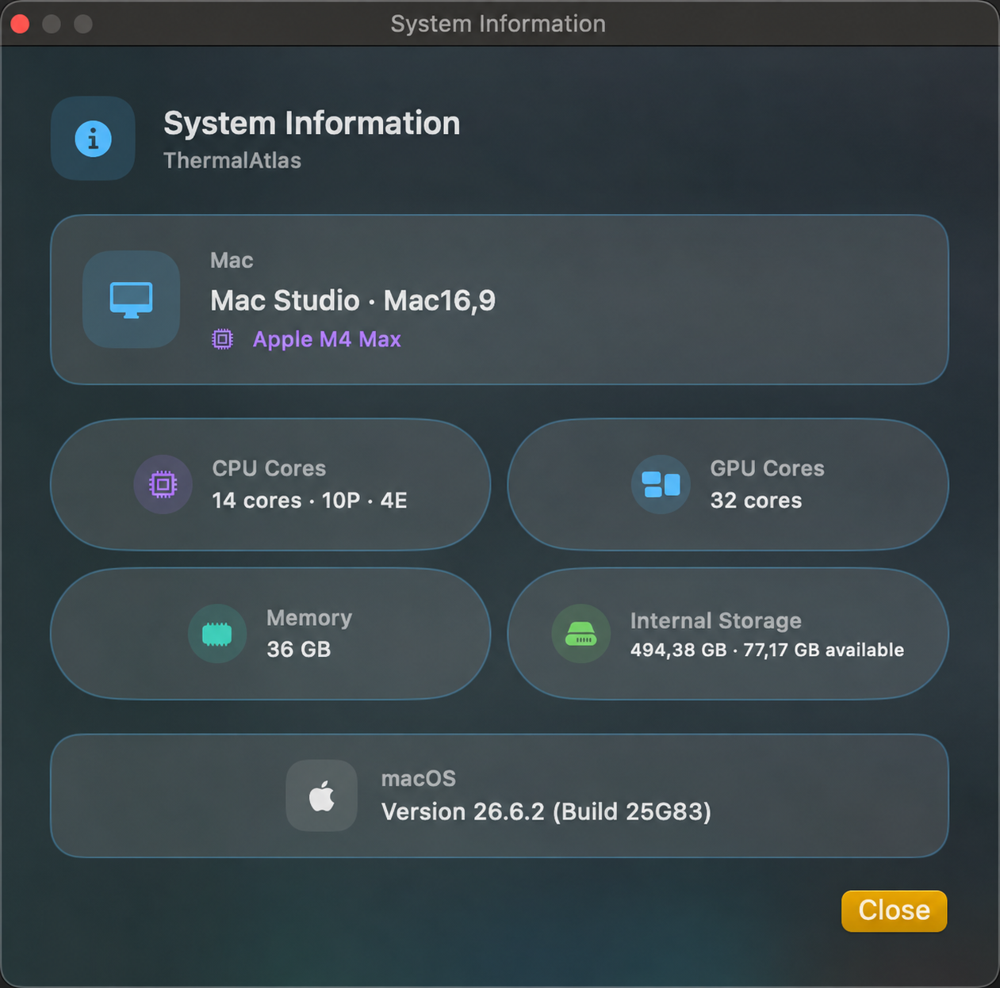

The information is read only when you open this window. ThermalAtlas does not collect or display serial numbers, UUIDs, or other hardware identifiers. Use **Close** or the macOS window close button to dismiss it.

---

## 3. Menu bar display

After launch, ThermalAtlas can show compact, colour-coded sensor symbols and every currently available temperature from the selected groups in the macOS menu bar. CPU is gold, GPU blue, the internal SSD cyan and external SSDs green; unavailable sensors do not receive invented replacement values.

The displayed groups are controlled through **Visible Temperatures** in the shared menu and apply equally to the menu bar and the ThermalAtlas window. **Menu Bar Display** offers two modes: **All Values** is the default and shows the selected groups; **Symbol Only** hides temperature text and leaves only the ThermalAtlas symbol. Clicking the menu bar item opens the ThermalAtlas window.

  

---

## 4. Controls and shared menu

The circular **ellipsis** button in the footer opens one shared menu. It keeps all secondary actions together without adding extra buttons to the temperature display.

  

### Themes

Choose **Themes** in the shared menu to select an appearance. The selected item has a checkmark.

  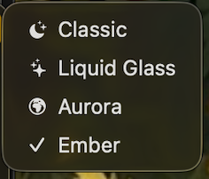

- **Adaptive** - follows the macOS light or dark appearance with a restrained system-material surface
- **Liquid Glass** - cool-tinted translucent glass surfaces with an opaque fallback when Reduce Transparency is enabled
- **Aurora** - dark blue and purple tones
- **Ember** - warm red and orange tones

Changing the theme affects appearance only, not sensor logic. The selection is stored locally. All four appearances show the same sensor data.

| Adaptive | Liquid Glass |
| --- | --- |
|  |  |
| **Aurora** | **Ember** |
|  |  |

### Scan Refresh

Choose **Scan Refresh** to select 1, 2, 3 or 4 seconds. The default is 2 seconds and the current choice has a checkmark.

  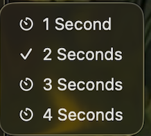

A shorter interval makes the display react sooner to real changes, but asks the read-only sensor sources more often. A longer interval reduces those checks. The interval affects only how often ThermalAtlas asks for new readings; it does not alter the Mac's cooling, power settings or hardware behavior.

### Window Size

Choose **Window Size** and then **Standard** or **Compact (about 40% smaller)**. Compact mode reduces the window width by about 40% and also uses denser cards, smaller spacing and smaller type so the display remains practical rather than merely squeezed. The chosen size is stored locally.

  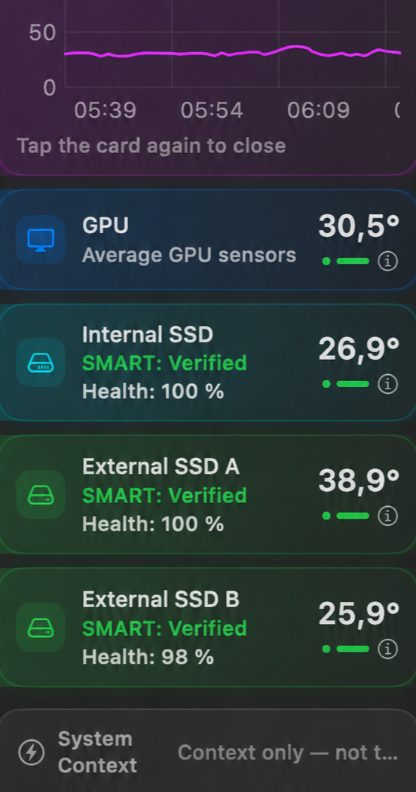

  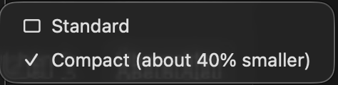

### Visible Temperatures

Choose **Visible Temperatures** to show or hide CPU, GPU, Internal SSD or all External SSDs. The selection affects both the menu bar and the temperature-card window immediately. External SSDs are switched as one group, while each detected drive still keeps its own card when the group is visible. At least one group remains selected so ThermalAtlas always has a visible temperature surface.

  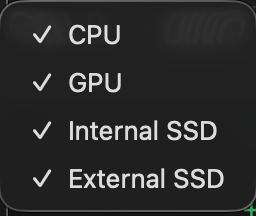

### Menu Bar Display

Choose **Menu Bar Display** to decide how much space ThermalAtlas uses in the macOS menu bar. **All Values** shows the temperatures from the groups selected under **Visible Temperatures**. **Symbol Only** leaves just the ThermalAtlas thermometer symbol; the selected groups remain unchanged and are still visible in the app window. The chosen mode is stored locally.

  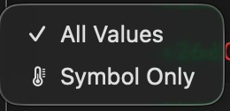

### Temperature History

Click a temperature card to open its local **Temperature History**. Choose **1 Hour**, **6 Hours** or **24 Hours**; the orange dashed line marks that sensor group's selected warning threshold. ThermalAtlas stores minute averages for real, readable values only and keeps at most 24 hours. Right after launch, the chart needs two separate minutes before it can draw a line. A temporarily retained GPU value is clearly marked and is not recorded as a new measurement.

  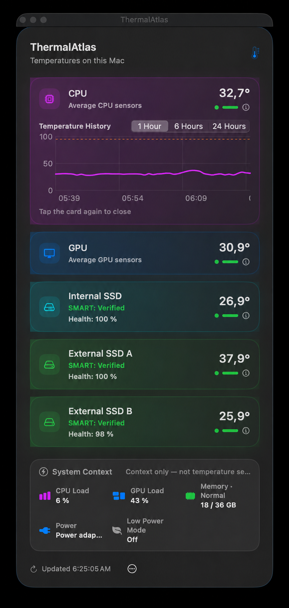

### Temperature Alerts

Choose **Temperature Alerts** to enable or disable local macOS notifications. CPU, GPU, Internal SSD and External SSD each have their own threshold submenu. CPU and GPU offer 85, 90, 95 or 100 °C; SSDs offer 60, 65, 70 or 75 °C. A notification is sent only after a genuine value has remained at or above its threshold for at least one minute. The same temperature episode does not notify again until the sensor has cooled below the threshold. macOS may ask for notification permission when alerts are first enabled.

  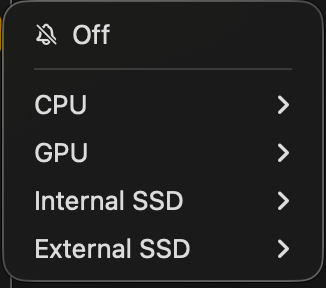
  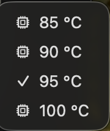

### Start at Login

Choose **Start at Login** to let macOS launch ThermalAtlas after you sign in. Choosing it again disables the registration. This changes only the app's own login-item registration; it does not alter any power, performance or sensor setting.

### Export

Choose **Export** to prepare local diagnostic data on demand. **Copy Current Readings** places the current snapshot as text on the clipboard. **Copy Diagnostic Report** copies the Mac model, macOS version, chip name and current readable or unavailable sensor states. **Export CSV** opens a normal macOS save dialog and writes a CSV containing the available minute averages from the local history plus the current snapshot. ThermalAtlas creates no export file until you choose a location.

  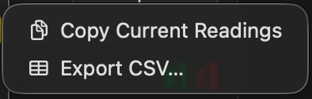

### Language

ThermalAtlas starts in **English**. Choose **Language** in the shared menu, then select **English** or **Deutsch**. The selection changes the visible app text and is stored locally; it does not translate drive names or alter sensor data.

  

### Links, manuals, Activity Monitor and quit

The same menu provides direct links to the public **GitHub repository**, the **ThermalAtlas homepage**, and both manuals. Choosing **Open Activity Monitor** opens the macOS Activity Monitor app. Choosing **Quit ThermalAtlas** stops the app and periodic sensor refresh.

  

Opening a public link happens only after you select it and hands its public URL to your default browser. Temperature monitoring itself has no network feature.

---

## 5. CPU and GPU temperatures

ThermalAtlas uses read-only Apple-silicon SMC access through IOKit for CPU and GPU temperature data.

### CPU

For CPU temperature, ThermalAtlas calculates the arithmetic mean of the readable CPU sensors. This provides one compact average instead of a long list of individual cores.

### GPU

The GPU value is likewise calculated as an average of available GPU zones. If all matching GPU zones are temporarily unavailable, the app follows the clearly labeled last-real-value behavior described above and then correctly returns to **Not available** when that value expires.

---

## 6. SSD temperatures, SMART and “Not available”

ThermalAtlas uses drive information exposed by macOS through `diskutil`. It shows the actual internal-drive name and each detected physical external SSD's mounted volume or drive name as a separate card. Virtual disk images are ignored.

An SSD temperature is shown only when a genuine SMART value is present. For external SSDs in particular, this depends on whether the drive, USB/Thunderbolt controller and enclosure pass temperature information through to macOS.

### When “Not available” appears

This does not automatically mean that anything is wrong with the drive. Possible reasons include:

- macOS does not expose a temperature value for the device.
- The external enclosure does not pass SMART information through.
- A sensor is not available through the read-only path used on this Mac model.
- No matching external solid-state drive was detected.

In these cases ThermalAtlas deliberately shows **no invented or estimated value**.

---

## 7. Installation

### Download

Download an available macOS package only from the official [ThermalAtlas Releases](https://github.com/Schrotty74/ThermalAtlas/releases).

1. Open the DMG.
2. Drag `ThermalAtlas.app` to Applications.
3. Launch ThermalAtlas.

### Gatekeeper on first launch

Public builds are currently ad-hoc signed and are not notarized with an Apple Developer Program identity. macOS may therefore show a warning on first launch.

1. In Finder, right-click or Control-click `ThermalAtlas.app`.
2. Choose **Open**.
3. Confirm **Open** in the macOS dialog.
4. If macOS still blocks it: **System Settings -> Privacy & Security -> Open Anyway**.

Only approve such an exception for an app downloaded from the official ThermalAtlas repository.

---

## 8. Privacy

ThermalAtlas is privacy-friendly and local by design:

- no user accounts
- no telemetry
- no analytics services
- no cloud synchronization
- no advertising SDKs
- no temperature storage beyond the bounded local history described below
- no network feature required for temperature monitoring
- no third-party dependencies

Only the selected theme, scan-refresh interval, visible temperature groups, menu bar display mode, window size, display language and warning thresholds are stored locally. ThermalAtlas also keeps no more than 24 hours of local, minute-averaged temperature history. CPU load, power source or battery, and Low Power Mode are displayed only and are not stored. No accounts, telemetry, analytics services or cloud synchronization are involved. See the [privacy report](PRIVACY.md) and [security review](SECURITY.md) for more detail.

---

## 9. Resource usage

ThermalAtlas is architecturally compact: a menu bar app, one sensor snapshot at the selected interval, and read-only sensor access. This manual deliberately does **not** claim “extremely low CPU/GPU usage” until that statement has been backed by a reproducible runtime measurement with recorded values.

---

## 10. Requirements and project status

- macOS 14 or later
- Apple silicon
- For local builds: Xcode Command Line Tools including Swift and `actool`

ThermalAtlas v1.0.0 is the first stable release. Future stable releases and prereleases are published through [GitHub Releases](https://github.com/Schrotty74/ThermalAtlas/releases).

---

## 11. More information

- [ThermalAtlas home page](README.md)
- [Releases and downloads](https://github.com/Schrotty74/ThermalAtlas/releases)
- [Privacy report](PRIVACY.md)
- [Security review](SECURITY.md)
- [Source code](https://github.com/Schrotty74/ThermalAtlas)
- [Deutsches Benutzerhandbuch](MANUAL.de.md)
