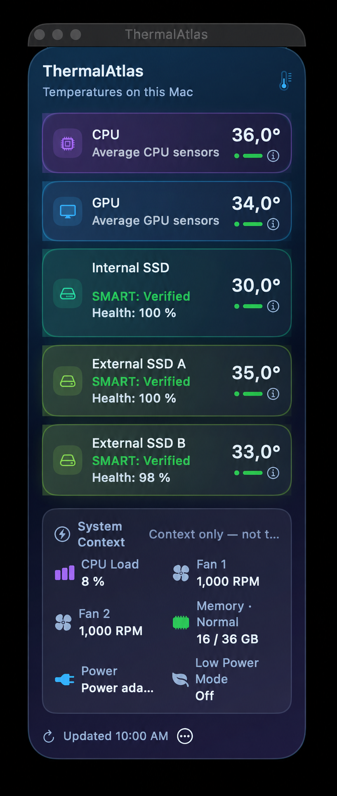

# ThermalAtlas – Datenschutzfreundliche macOS-Menüleisten-Temperaturanzeige für Apple Silicon

[](Package.swift)
[](#voraussetzungen)
[](LICENSE)
[](https://github.com/Schrotty74/ThermalAtlas/releases)
[](https://github.com/Schrotty74/ThermalAtlas/releases)
[](PRIVACY.de.md)

<p align="center"></p>

[English](README.md) · **Deutsch**

📘 **[Benutzerhandbuch (PDF)](Documentation/ThermalAtlas-Handbuch-DE.pdf)** – Oberfläche, Buttons, Sensoren, Themes, Installation und Datenschutz ausführlich erklärt.

> [!IMPORTANT]
> **ThermalAtlas v1.2.0 ist die aktuelle stabile Veröffentlichung.** Der Branch `main` enthält den finalen Quellstand. Die getesteten Funktionen aus Beta 1.2.0-beta.7 sind enthalten; diese bleibt die neueste Beta im [`beta`-Branch](https://github.com/Schrotty74/ThermalAtlas/tree/beta).

## Überblick

ThermalAtlas ist eine schlanke, datenschutzfreundliche und lokale macOS-Menüleisten-App für Apple Silicon. Sie zeigt echte Sensorwerte für CPU, GPU, interne SSD und jede erkannte physische externe SSD, sobald macOS sie bereitstellt – ohne Telemetrie, Konten oder Hardwaresteuerung. Die Oberfläche startet auf Englisch und bietet Deutsch als optional wählbare Anzeigesprache.

Die App richtet sich an Menschen, die die thermische Auslastung ihres Macs ohne Hardwaresteuerung prüfen möchten: Sie aktualisiert sich standardmäßig alle zwei Sekunden, zeigt nicht verfügbare Messwerte klar statt sie zu schätzen und verändert niemals Lüfter, Energieoptionen oder Systemeinstellungen. Die Temperaturanzeige funktioniert offline und enthält keine Konten oder Telemetrie. Optionale Updateprüfungen kontaktieren GitHub.

Weder Administrator- noch Root-Rechte sind nötig. ThermalAtlas verfolgt einen rein lesenden Ansatz und liest ausschließlich von macOS bereitgestellte Sensordaten.

## Funktionen

- Überwacht verfügbare Temperaturen von CPU, GPU, interner SSD und physischen externen SSDs, ohne fehlende Werte zu schätzen.
- Zeigt weiterhin CPU-/GPU-Durchschnittswerte auf Karten, in der Menüleiste und im Verlauf. In den Sensor-Details stehen Hotspot und Anzahl gültiger Sensoren; CPU-/GPU-Warnungen verwenden den Hotspot.
- Zeigt SMART-Status und verbleibende SSD-Gesundheit, sobald macOS diese Werte bereitstellt.
- Trennt schnellen, rein lesenden Systemkontext für CPU-Last, Lüfterdrehzahlen und belegten Arbeitsspeicher von der Temperaturüberwachung.
- Führt lokale Temperaturverläufe, bietet optionale Temperaturwarnungen und exportiert Snapshot oder CSV nur auf Wunsch.
- Bietet Standard, Kompakt und eine verschiebbare Mini-Anzeige sowie wählbare Sensorgruppen und Menüleistenmodi.
- Zeigt beim Anklicken oder Ziehen im Temperaturgraphen Uhrzeit und Minutenmittelwert des gewählten Punktes. Pfeiltasten und Buttons Vorherige/Nächste Minute wechseln zwischen Punkten; Escape hebt die Auswahl auf. Zeitlabels folgen der App-Sprache, einzelne Messpunkte bleiben sichtbar.
- Öffnet über das Thermometer im Kopf lokale Systeminformationen mit dem thermischen macOS-Zustand und bietet **Immer im Vordergrund** sowie optional **Bei Anmeldung starten**.
- Prüft GitHub manuell oder optional täglich, wöchentlich oder monatlich auf neuere Final- und Beta-Versionen. Download und Installation wählst du selbst.
- Enthält vier native Themes und eine lokale Sprachwahl zwischen Englisch und Deutsch.
- Unterstützt VoiceOver für native Temperaturkarten und Mini-Anzeige, deren Tastaturbedienung mit Return und Leertaste, Bewegung reduzieren und Transparenz reduzieren sowie die Icon-Erscheinungen Standard, Dunkel und Monochrom auf unterstützten macOS-Versionen.
- Erklärt den Systemkontext getrennt von den Temperaturen. Bei einem fehlgeschlagenen CSV-Speichervorgang zeigt die App den macOS-Fehler und bietet „Erneut versuchen…“ an, um den Speicherdialog erneut zu öffnen.
- Nutzt defensiven Apple-Silicon-Sensorzugriff und getrennte Laufwerkszyklen, damit langsame Laufwerksabfragen CPU-/GPU-Temperaturen nicht verzögern.
- Funktioniert lokal ohne Konten, Telemetrie, Analysedienste, Drittanbieter-Abhängigkeiten oder Hardwaresteuerung.
- Ein Klick auf einen Lüfterwert öffnet dessen lokalen Verlauf. Temperatur- und Lüfterdiagramme bieten 1/3/6/12/24 Stunden, Min/Max/Ø der Minutenmittelwerte und Punktwahl. Sensor-Details zeigen das Messwertalter; überbrückte GPU-Werte auch direkt auf der Karte.

Die vollständige, gegliederte [Funktionsübersicht](FEATURES.de.md) enthält alle Details.

## Screenshots und Themes

Adaptiv verwendet ab Beta 1.2.0-beta.6 neutrale macOS-Flächen im Hell- und Dunkelmodus. Die Laufwerksnamen in den Bildern sind anonymisiert.

| Adaptiv – Hellmodus | Adaptiv – Dunkelmodus |
| --- | --- |
|  |  |

| Liquid Glass | Aurora |
| --- | --- |
|  |  |
| Ember | Kompaktansicht |
|  |  |

## Voraussetzungen

- macOS 14 oder neuer
- Apple-Silicon-Mac

### Selbst aus dem Quellcode bauen

- Xcode Command Line Tools mit Swift und `actool`

## Download, Installation und Nutzung

Lade das stabile macOS-Paket über die [GitHub Releases](https://github.com/Schrotty74/ThermalAtlas/releases) herunter. Öffne das DMG und ziehe ThermalAtlas zur Installation auf den `Applications`-Alias.

Nach dem Öffnen der App zeigt das Thermometer in der macOS-Menüleiste die aktuellen Temperaturen an. Das Thermometer im App-Kopf öffnet lokale Systeminformationen: Mac-Modell, Chip, thermischer macOS-Zustand, CPU-/GPU-Kerne, Arbeitsspeicher, interner Speicher sowie macOS-Version und Buildnummer. Die App liest diese Werte gezielt lokal ab; Seriennummern und UUIDs werden nicht abgefragt. Über den Dreipunkt-Button im Footer stehen Themes, Scan Refresh, Anzeigeoptionen, Warnungen, Export, Immer im Vordergrund, Bei Anmeldung starten, App-Updates, die optionale deutsche Oberfläche, Handbücher, Links, Aktivitätsanzeige und Beenden bereit. Ein Klick auf eine Karte öffnet ihren lokalen Temperaturverlauf; das Info-Symbol zeigt die Sensor-Details mit CPU-/GPU-Hotspot und Anzahl gültiger Sensoren. Wenn ein Sensor, eine SSD oder ein externes Gehäuse keinen echten Temperaturwert bereitstellt, zeigt die App `Nicht verfügbar`.

### Gatekeeper-Bestätigung

Öffentliche Builds sind ad-hoc signiert und nicht mit einer Apple-Developer-Program-Signatur notarisiert. macOS Gatekeeper kann deshalb den ersten Start blockieren. Bestätige die App nur, wenn du sie aus dem offiziellen [ThermalAtlas-GitHub-Release](https://github.com/Schrotty74/ThermalAtlas/releases) geladen hast.

Wenn Gatekeeper ThermalAtlas auf einer aktuellen macOS-Version blockiert:

1. `ThermalAtlas.app` einmal normal zu öffnen versuchen, damit macOS den blockierten Start registriert.
2. **Systemeinstellungen → Datenschutz & Sicherheit** öffnen und zum Bereich **Sicherheit** scrollen.
3. Bei ThermalAtlas auf **Dennoch öffnen** klicken.
4. Die Warnung mit **Öffnen** bestätigen und bei Bedarf authentifizieren.

Die Option **Dennoch öffnen** wird nach einem blockierten Startversuch nur für begrenzte Zeit angezeigt. Dadurch wird nur für diese konkrete App eine Ausnahme angelegt; Gatekeeper wird nicht systemweit deaktiviert.

## Veröffentlichte Build-Kanäle

Jeder veröffentlichte Kanal hat eine eigene Bundle-Kennung, eigene `UserDefaults`, ein eigenes App-Bundle und einen eigenen Swift-Build-Cache.

| Kanal | Build-Befehl | Bundle-Kennung | Ausgabe |
| --- | --- | --- | --- |
| Beta | `./build_beta_app.sh` | `io.github.schrotty74.thermalatlas.beta` | `Build/Beta/ThermalAtlas Beta.app` |
| Final | `./build_final_app.sh` | `io.github.schrotty74.thermalatlas` | `Build/Final/ThermalAtlas.app` |

Veröffentlichte Builds werden lokal ad-hoc signiert. Ein Build veröffentlicht nichts.

## Datenschutz, Datenverarbeitung und Sicherheit

ThermalAtlas liest lokale Apple-Silicon-SMC-Temperaturen, lokale Laufwerksmetadaten, SMART-Temperaturen, CPU-Last, Lüfterdrehzahlen, belegten Arbeitsspeicher, Stromquelle/Akku und Energiesparmodus nur dann, wenn macOS sie bereitstellt. Die Systeminformationen lesen die angezeigten Werte und den thermischen Zustand gezielt lokal ab; Seriennummern und UUIDs werden nicht abgefragt. Lokal gespeichert werden Anzeigeneinstellungen einschließlich Mini-Anzeige und „Immer im Vordergrund“, Warnschwellen und lokale Temperatur-Minutenmittelwerte für höchstens 24 Stunden in `UserDefaults`; CPU-Last, RAM, Energiezustand und Systeminformationen werden nur angezeigt. Lüfter-Minutenmittelwerte werden ebenfalls lokal für höchstens 24 Stunden gespeichert. Die App enthält keine Telemetrie, Analyse-Dienste, Konten, Cloud-Synchronisation, Werbe-SDKs oder Drittanbieter-Abhängigkeiten.

Die optionale Funktion App-Updates prüft GitHub auf neuere Final- und Beta-Versionen. Jetzt prüfen startet sofort; automatische Prüfungen sind zunächst aus und können täglich, wöchentlich oder monatlich erfolgen. Dabei werden keine Sensor-, Laufwerks-, Geräte- oder installierten Versionsdaten gesendet. GitHub erhält die IP-Adresse der Verbindung. Gespeicherte Cookies oder Zugangsdaten werden nicht verwendet; Updates werden nicht automatisch heruntergeladen oder installiert. Updateintervalle, Prüfzeitpunkte und bereits gemeldete Release-Tags werden lokal gespeichert.

Ein Diagnosebericht oder CSV-Export entsteht nur nach einer ausdrücklichen Auswahl. Die optionalen Menüeinträge GitHub, Homepage und Handbücher öffnen die gewählte öffentliche Seite nur nach einem Klick im Standardbrowser.

Siehe [Datenschutzbericht](PRIVACY.de.md), [Privacy report](PRIVACY.md) und die [Sicherheitsprüfung](SECURITY.md).

## Hardware-Kompatibilität

Die CPU- und GPU-Erkennung ist auf M4 Max, M5 und M5 Pro auf echter Hardware bestätigt. Die weiteren M1- bis M5-Varianten und ihre Rohsensoren sind defensiv implementiert, müssen aber noch auf echter Hardware geprüft werden. Wenn macOS oder ein Gerät keinen verwendbaren Sensorwert bereitstellt, zeigt ThermalAtlas `Nicht verfügbar`, statt einen Wert zu schätzen.

## Projektstatus

ThermalAtlas v1.2.0 ist die aktuelle stabile Veröffentlichung. Künftige stabile Versionen und Vorabversionen werden über die [GitHub Releases](https://github.com/Schrotty74/ThermalAtlas/releases) veröffentlicht.

## Community

Fragen, Feedback und Diskussionen sind auf [Discord](https://discord.gg/Zy93AaYFaj) willkommen.

## Lizenz

ThermalAtlas steht unter der [GNU General Public License v3.0](LICENSE).

## Links

- [Benutzerhandbuch (PDF)](Documentation/ThermalAtlas-Handbuch-DE.pdf)
- [Funktionsübersicht](FEATURES.de.md)
- [Releases und Downloads](https://github.com/Schrotty74/ThermalAtlas/releases)
- [Changelog (English)](CHANGELOG.md)
- [Datenschutzbericht](PRIVACY.de.md)
- [Sicherheitsprüfung](SECURITY.md)
- [Quellcode](https://github.com/Schrotty74/ThermalAtlas)

## Entwicklung

```zsh
swift test -c debug
```

`Build/` und `.build/` werden absichtlich ignoriert.
