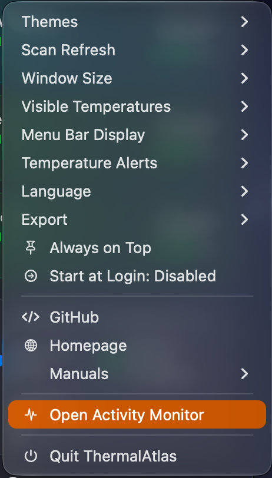

# ThermalAtlas – Privacy-Friendly macOS Menu Bar Temperature Monitor for Apple Silicon

[](Package.swift)
[](#requirements)
[](LICENSE)
[](https://github.com/Schrotty74/ThermalAtlas/releases)
[](https://github.com/Schrotty74/ThermalAtlas/releases)
[](PRIVACY.md)

<p align="center"></p>

**English** · [Deutsch](README.de.md)

📘 **[User Manual (PDF)](Documentation/ThermalAtlas-User-Manual-EN.pdf)** – interface, buttons, sensors, themes, installation and privacy explained in detail.

## Overview

ThermalAtlas is a lightweight, privacy-friendly, local-first macOS menu bar temperature monitor for Apple silicon. It shows real CPU, GPU, internal SSD, and every detected physical external SSD sensor value whenever macOS exposes it, without telemetry, accounts, or hardware control.

The app is designed for people who want to check Mac thermal conditions without a hardware-control tool: it defaults to a two-second refresh interval, clearly shows unavailable measurements instead of estimating them, and never changes fan, power, or system settings. Its interface defaults to English and includes an optional German display language. ThermalAtlas works offline and has no accounts, analytics, or network communication.

No admin/root access is required. ThermalAtlas uses a read-only approach and only reads sensor data exposed by macOS.

## Features

- Defaults to a two-second refresh interval.
- Lets you choose a local Scan Refresh interval from 1 to 4 seconds in one-second steps.
- Refreshes the separate System Context every 0.5 seconds with total CPU load, total GPU load, and used memory relative to installed RAM; this does not change the selected temperature interval.
- Shows **Not available** rather than estimating missing values.
- Reads SSD SMART temperatures only when macOS exposes them.
- Lists each detected physical external SSD separately with its mounted volume name when available, and ignores virtual disk images.
- Shows the SSD SMART health status reported by macOS alongside the drive name.
- Shows remaining SSD health when macOS exposes NVMe `PERCENTAGE_USED`; it does not estimate a percentage when that field is unavailable.
- Uses a defensive, read-only Apple-silicon SMC adapter for CPU and GPU.
- Lets you choose which CPU, GPU, internal SSD, and external SSD groups appear in the popover and menu bar.
- Offers an **All Values** menu bar display or a space-saving **Symbol Only** display while keeping the chosen sensor groups.
- Offers Standard and Compact popover sizes; Compact is about 40% narrower and keeps the history controls readable.
- Shows a local 1-, 6-, or 24-hour temperature history when you open a card. It stores only local per-minute averages for up to 24 hours.
- Provides per-group temperature alerts after a sustained threshold crossing, with separate CPU/GPU and SSD thresholds.
- Shows source, latest valid reading, and update time in Sensor Details without replacing the temperature history.
- Exports the current readings as copyable text or the local history plus a current snapshot as CSV, only after you choose an export location.
- Separates CPU load, GPU load, used memory, power source/battery, and Low Power Mode as read-only **System Context**, clearly distinct from temperature sensors.
- Recognizes separate CPU and GPU sensor-key families for Apple-silicon M1 through M5, including known Pro, Max, and Ultra variants; unsupported future generations remain explicitly unavailable rather than guessed.
- Refreshes external-drive topology at launch and when macOS reports mounting or unmounting. Mounted physical SSDs remain separate cards; an ejected but still connected drive is hidden.
- Reads known SSD temperatures every minute for local history and warnings, while SMART status and remaining health are refreshed at launch, after an actual topology change, and at most once per day.
- Provides four native themes, including adaptive Liquid Glass.
- Groups Themes, Scan Refresh, Window Size, Visible Temperatures, Menu Bar Display, Temperature Alerts, Language, Export, public links, manuals, Activity Monitor, and Quit in one compact shared menu.
- Starts in English and lets you switch the visible app interface to German locally.
- Has no third-party dependencies, network communication, analytics, or accounts.

## Screenshots and themes

| Classic | Liquid Glass |
| --- | --- |
|  |  |
| Aurora | Ember |
|  |  |

## Shared menu and display options

The footer ellipsis opens one shared menu, keeping the temperature view focused. It contains four appearance choices, **Scan Refresh** (1, 2, 3, or 4 seconds; default: 2 seconds), **Window Size** (Standard or Compact), **Visible Temperatures**, **Menu Bar Display** (All Values or Symbol Only), **Temperature Alerts**, **Language**, and **Export**. The checkmark identifies the active choice.

<p align="center"></p>

Use **Visible Temperatures** to choose the sensor groups shown in both the popover and menu bar. **Export** can copy the current snapshot or save the local temperature history plus that snapshot as CSV. The menu also links to GitHub, the project homepage, and both manuals. **Open Activity Monitor** launches the macOS app only after you choose it; **Quit ThermalAtlas** ends the app and its periodic read-only refresh.

## Requirements

- macOS 14 or later on Apple silicon
- Xcode command-line tools, including Swift and `actool`

## Download, installation, and usage

Download the available macOS prerelease packages from [GitHub Releases](https://github.com/Schrotty74/ThermalAtlas/releases). Open the DMG and drag ThermalAtlas to the `Applications` alias to install it.

After opening the app, use the thermometer in the macOS menu bar to view the current temperatures. Open the footer ellipsis for visual themes, Scan Refresh, display options, alerts, export, the optional German interface, manuals, links, Activity Monitor, and Quit. Select a card for its local temperature history; use its info button for sensor details. The app displays `Not available` when a sensor, SSD, or external enclosure does not provide a real temperature.

### Gatekeeper confirmation

Public prerelease builds are ad-hoc signed and are not notarized with an Apple Developer Program signing identity. macOS Gatekeeper can therefore ask you to confirm the first launch. Only approve the app after downloading it from the official [ThermalAtlas GitHub Release](https://github.com/Schrotty74/ThermalAtlas/releases).

1. In Finder, Control-click (or right-click) `ThermalAtlas.app` and choose **Open**.
2. Confirm **Open** in the macOS dialog.
3. If macOS still blocks the app, open **System Settings → Privacy & Security**, then choose **Open Anyway** for ThermalAtlas and confirm the next dialog.

## Build channels

Each channel has its own bundle identifier, `UserDefaults` domain, app bundle, and Swift build cache.

| Channel | Build command | Bundle identifier | Output |
| --- | --- | --- | --- |
| Dev | `./build_dev_app.sh` | `io.github.schrotty74.thermalatlas.dev` | `Build/Dev/ThermalAtlas Dev.app` |
| Beta | `./build_beta_app.sh` | `io.github.schrotty74.thermalatlas.beta` | `Build/Beta/ThermalAtlas Beta.app` |
| Final | `./build_final_app.sh` | `io.github.schrotty74.thermalatlas` | `Build/Final/ThermalAtlas.app` |

All builds are ad-hoc signed locally. Building does not publish a release.

## Privacy, data handling, and security

ThermalAtlas reads local Apple-silicon SMC temperatures, local drive metadata, SMART temperature data, CPU/GPU load, used memory, power source/battery, and Low Power Mode only when macOS provides them. It stores selected display preferences, alert thresholds, and local per-minute temperature averages for up to 24 hours in local `UserDefaults`; system-context values are displayed but not stored. The app has no background network features, telemetry, analytics, accounts, cloud sync, advertising SDKs, or third-party dependencies. A text or CSV export is created only after you explicitly choose it and a local save location. Its optional GitHub, Homepage, and manual menu actions open the selected public page in your default browser only after you select them.

See [Privacy report](PRIVACY.md), [Datenschutzbericht](PRIVACY.de.md), and the [security review](SECURITY.md).

## Project status

ThermalAtlas is in active development. Downloadable prerelease builds are published through [GitHub Releases](https://github.com/Schrotty74/ThermalAtlas/releases); Dev builds remain local.

## Repo activity


## License

ThermalAtlas is licensed under the [GNU General Public License v3.0](LICENSE).

## Links

- [User Manual (PDF)](Documentation/ThermalAtlas-User-Manual-EN.pdf)
- [Releases and downloads](https://github.com/Schrotty74/ThermalAtlas/releases)
- [Changelog](CHANGELOG.md)
- [Privacy report](PRIVACY.md)
- [Security review](SECURITY.md)
- [Source code](https://github.com/Schrotty74/ThermalAtlas)

## Development

```zsh
swift test -c debug
./build_dev_app.sh
```

`Build/` and `.build/` are intentionally ignored.
